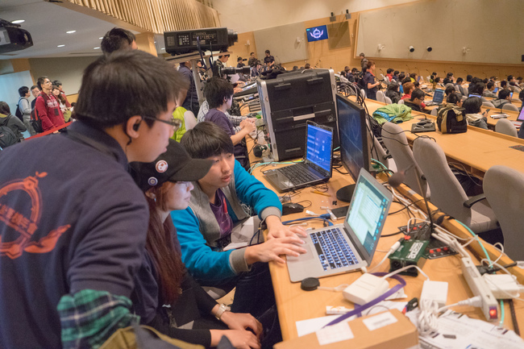
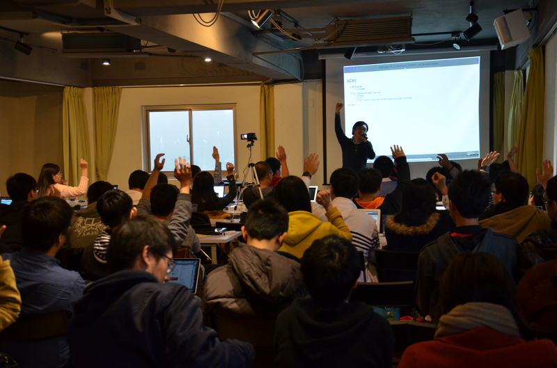
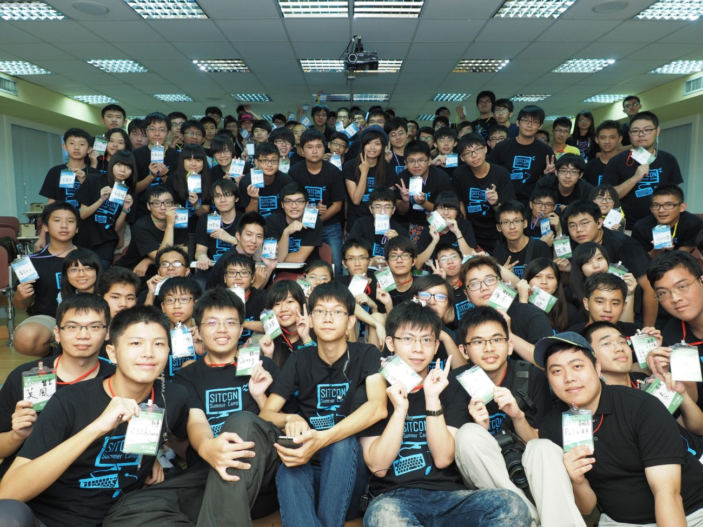
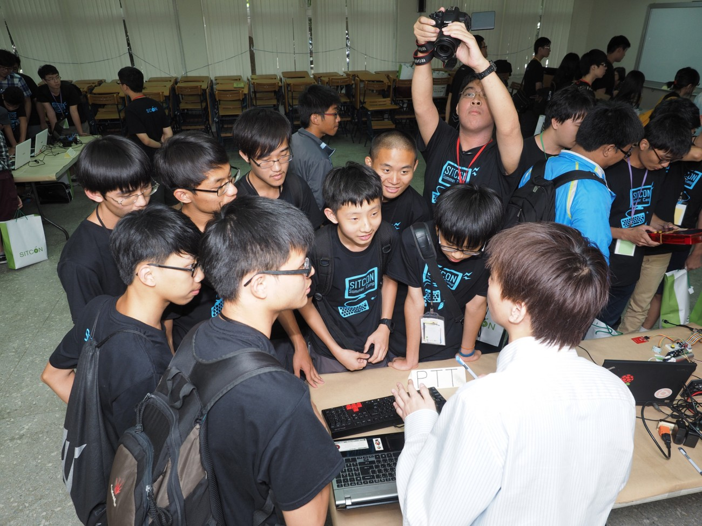
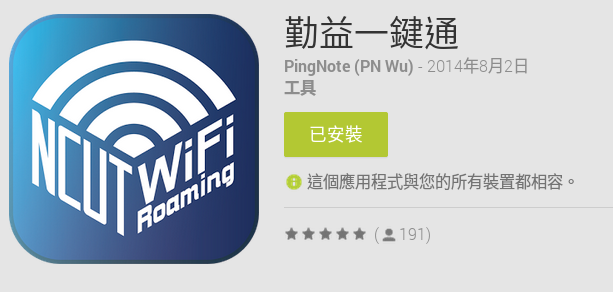
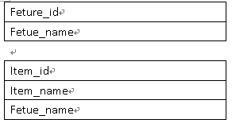

title: 亞東分享
output: index.html
--
<h1 style="font-size: 72px">
    亞東分享
</h1>

## Cake Chen 陳冠廷
## 2017/05/01

--
### Who am I ?

 
<h2 style="font-size: 60px">
    <b>Cake Chen 陳冠廷</b>
</h2>

* 前進國際 Advtek Inc.
* SITCON 2015 場務組門機小組組長
* SITCON CAMP 2015 財務組長
* 內政部役政署替代役訓練班分隊長
* <a href="https://www.facebook.com/cake1222.tw">facebook </a>
--
# 求學經驗
* 社團
* 實習

--
# 社群經驗
<h2 style="font-size: 60px">
    <b>SITCON</b>
</h2>
 

--

 

   
  <a href="http://sitcon.org/">http://sitcon.org</a>

--

  

--

  

--

 
 

  

--

  

--

  

--

  

--

  

--

# Workshop

--

--

--

--

  

--

  

--

# Summer Camp

--

  

--

  

--

  

--

  

--

  

--

### Meetup
* Taipei
sitcon.Taipei 

--

<h1>
  
</h1>
## http://hackgen.sitcon.org/

--

  

--

  

--

  

--

  

--

  

--

  

--

  

--
### Basic
* 資料結構
* 統計學 -> big data
* Database basic 
* network -> basic, security, iso27001

--
### example 
* Database 正規化 eample

    

---
### example
* 80 port 

--

### 結論

* 資源
* 社團經驗
* 社群
* 充實自己課外知識

--

<h1 style="font-size: 72px">
  Thanks for listening!
</h1>

   

  

<h2 style="font-size: 18px">
本投影片採用<a href="http://creativecommons.org/licenses/by-sa/3.0/tw/" target="_blank">創用 CC「姓名標示—相同方式分享 3.0 台灣」授權條款</a>
</h2>